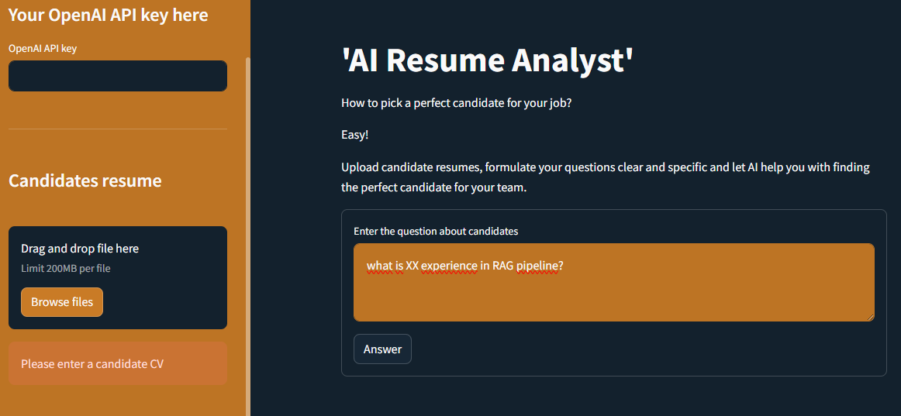

# AI Resume Analyst

AI Resume Analyst is a tool designed to streamline the recruitment process using cutting-edge AI and Natural Language Processing (NLP) technologies. With AI Resume Analyst, recruiters can easily upload candidate resumes, ask specific questions, and receive detailed, context-aware answers, helping them find the perfect candidate for their job.

## Features

- **Automated Resume Analysis**: Upload candidate resumes in PDF format, and let AI extract and analyze the content.
- **Context-Aware Q&A**: Formulate clear and specific questions about candidates, and the AI will generate detailed answers based on the provided resumes.
- **OpenAI GPT Integration**: Leveraging the power of GPT-4 to generate human-like responses to your queries.
- **Haystack Integration**: Utilizes Haystack for document processing, embedding, and retrieval to ensure precise and relevant answers.



## Installation

1. **Clone the repository**:
   ```bash
   git clone https://github.com/yourusername/AI-Resume-Analyst.git
   cd AI-Resume-Analyst

2. **Install the dependencies:**:
   ```bash
    pip install -r requirements.txt

3. **Set up environment variables:**:
    Create a .env file in the root directory.
    Add your OpenAI API key to the .env file
   ```bash
    OPENAI_API_KEY=your-openai-api-key

## Usage
1. Enter your OpenAI API key in the sidebar.
2. Upload candidate resumes in PDF format using the sidebar uploader.
3. Formulate your question about the candidates in the provided text area.
4. Submit the form to receive AI-generated answers based on the resumes.

